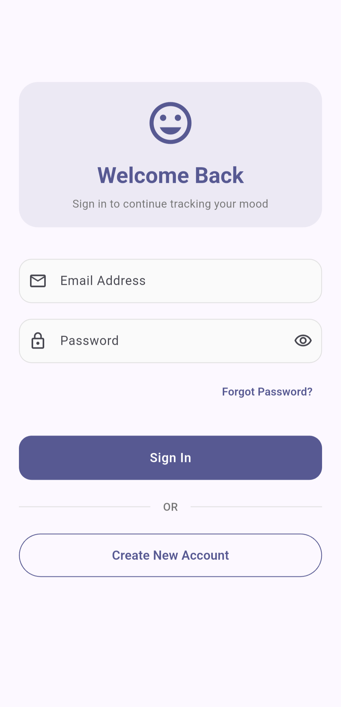
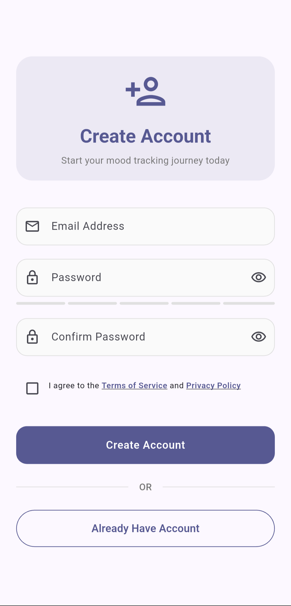
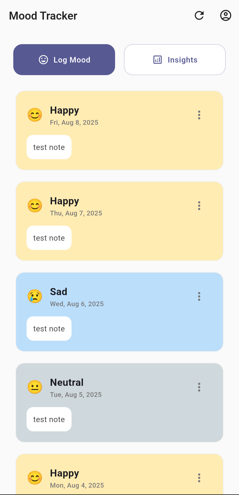
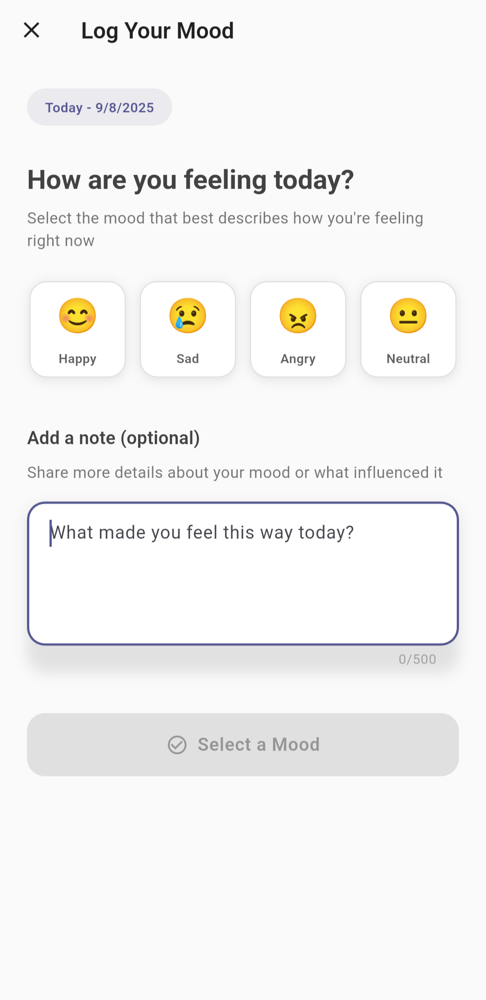
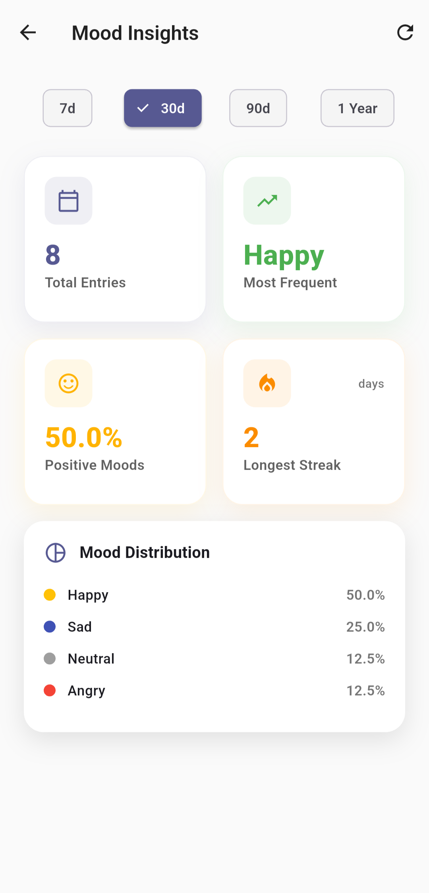

# Mood Tracker

<p align="center">
  </p>

A comprehensive Flutter application for tracking daily moods with insightful analytics and a beautiful, modern UI. Built with Firebase for secure user authentication and real-time data synchronization.

## 📱 Features

### Core Functionality

-   **Daily Mood Logging**: Track your mood once per day with 4 different mood options.
-   **Rich Note Support**: Add detailed notes (up to 500 characters) to describe what influenced your mood.
-   **Secure Authentication**: Firebase Auth integration with email/password sign-in and registration.
-   **Real-time Sync**: All data synced across devices using Cloud Firestore.
-   **Offline Caching**: Smart caching system for improved performance.

### Mood Options

The app supports 4 distinct moods, each with unique emoji representations:

-   😊 Happy
-   😢 Sad
-   😠 Angry
-   😐 Neutral

### Analytics & Insights

-   **Mood Distribution**: Visual breakdown of your most frequent moods.
-   **Streak Tracking**: Monitor your longest consecutive mood streaks.
-   **Positive Mood Percentage**: Track the percentage of positive emotions.
-   **Flexible Time Periods**: View insights for 7 days, 30 days, 90 days, or 1 year.
-   **Most Frequent Mood**: Identify your dominant emotional patterns.

### User Experience

-   **Material Design 3**: Modern, clean interface following Google's design principles.
-   **Smooth Animations**: Polished transitions and micro-interactions.
-   **Haptic Feedback**: Tactile responses for better user engagement.
-   **Dark Status Bar**: Optimized status bar styling.
-   **Portrait Lock**: Consistent user experience in portrait mode.

## 📸 Screenshots

<table width="100%" align="center">
 <tr>
    <td align="center" colspan="2"><strong>Authentication Flow</strong><br><sub>Login, Registration & Error Handling</sub></td>
 </tr>
 <tr>
    <td align="center">
      
    </td>
    <td align="center">
      
    </td>
 </tr>
  <tr>
    <td align="center" colspan="2"><strong>Core App Experience</strong><br><sub>Home Screen & Daily Mood Logging</sub></td>
 </tr>
  <tr>
    <td align="center">
      
    </td>
    <td align="center">
      
    </td>
 </tr>
   <tr>
    <td align="center" colspan="2"><strong>Analytics & Insights</strong><br><sub>Statistics, History & Mood Distribution</sub></td>
 </tr>
  <tr>
    <td align="center" colspan="2">
        
    </td>
 </tr>
</table>

## 🚀 Project Setup

### Prerequisites

-   Flutter SDK (3.0+)
-   Dart SDK (3.0+)
-   Android Studio / VS Code
-   A Firebase project

### Installation

1.  **Clone the repository**

    ```bash
    git clone https://github.com/yourusername/mood_tracker.git
    cd mood_tracker
    ```

2.  **Install dependencies**

    ```bash
    flutter pub get
    ```

3.  **Firebase Configuration**

    -   Create a new Firebase project at [Firebase Console](https://console.firebase.google.com).
    -   Enable Authentication (Email/Password provider).
    -   Enable Cloud Firestore.
    -   Download `google-services.json` (Android) and place it in the `android/app/` directory.

4.  **Firebase Rules Setup**
    Configure your Firestore security rules to protect user data:

    ```javascript
    rules_version = '2';
    service cloud.firestore {
      match /databases/{database}/documents {
        match /users/{userId} {
          allow read, write: if request.auth != null && request.auth.uid == userId;
          match /moods/{document} {
            allow read, write: if request.auth != null && request.auth.uid == userId;
          }
        }
      }
    }
    ```

5.  **Run the application**
    ```bash
    flutter run
    ```

## 🏗️ Project Structure

```
lib/
├── models/
│   └── mood_entry.dart          # MoodEntry data model
├── screens/
│   ├── home_screen.dart         # Main dashboard
│   ├── login_screen.dart        # Authentication screen
│   ├── mood_entry_screen.dart   # Mood logging interface
│   └── insights_screen.dart     # Analytics and statistics
├── services/
│   ├── auth_service.dart        # Authentication logic
│   └── mood_service.dart        # Mood data operations
└── main.dart                    # App entry point
```

## 🔧 Key Implementation Details

### Authentication Service

-   **Email/Password Authentication**: Secure user registration and login.
-   **Input Validation**: Email format and password strength validation.
-   **Error Handling**: User-friendly error messages for Firebase Auth exceptions.
-   **Password Reset**: Email-based password recovery system.

### Mood Service

-   **One Mood Per Day**: Enforced business rule preventing multiple mood entries per day.
-   **CRUD Operations**: Create, read, update, and delete mood entries.
-   **Intelligent Caching**: 5-minute cache TTL to reduce Firestore reads.
-   **Date-based Storage**: Moods stored with `YYYY-MM-DD` document IDs for efficient querying.
-   **Batch Operations**: Optimized queries for analytics and history retrieval.

### Data Models

-   **MoodEntry**: Core data structure with mood, note, and timestamp.
-   **Flexible Timestamp Handling**: Supports both Firestore `Timestamp` and `String` formats.
-   **Null Safety**: Comprehensive null-safe implementation throughout.

### UI/UX Design Patterns

-   **Animation Controllers**: Smooth page transitions and element animations.
-   **Responsive Design**: Adaptive layouts for different screen sizes.
-   **Color Psychology**: Mood-specific color coding for visual association.
-   **Loading States**: Proper loading indicators and error handling.

## 🎯 Technical Trade-offs & Decisions

### Architecture Choices

**✅ Service Layer Pattern**

-   **Pros**: Clear separation of concerns, testable business logic, reusable services.
-   **Cons**: Additional abstraction layer, more boilerplate code.
-   **Decision**: Chosen for maintainability and scalability.

**✅ Firebase as Backend**

-   **Pros**: Real-time sync, built-in authentication, automatic scaling, offline support.
-   **Cons**: Vendor lock-in, limited complex queries, pricing at scale.
-   **Decision**: Ideal for an MVP and small-to-medium applications.

**✅ Document-per-Day Storage**

-   **Pros**: Enforces the one-mood-per-day rule, efficient date-based queries, clear data structure.
-   **Cons**: Slightly more complex for cross-date analytics.
-   **Decision**: Aligns with business requirements and simplifies validation Logic.

### Performance Optimizations

**✅ Intelligent Caching**

-   5-minute cache TTL for mood history.
-   User-specific cache keys.
-   Cache invalidation on data mutations.

**✅ Lazy Loading**

-   Animations initialized only when needed.
-   Conditional widget rendering based on data state.

**✅ Optimized Queries**

-   Limited result sets (max 100 entries).
-   Date-range filtering at the database level.
-   Indexed timestamp field for fast sorting.

### Security Considerations

**✅ Authentication Required**

-   All operations require a valid Firebase Auth token.
-   User data isolation is enforced through security rules.

**✅ Input Validation**

-   Client-side validation for user experience.
-   Server-side validation through Firebase rules.
-   XSS prevention through proper text handling.

**✅ Data Privacy**

-   User data is scoped to the authenticated user only.
-   No data sharing between users.
-   Secure transmission over HTTPS.

## 🙏 Acknowledgments

-   **Flutter Team**: For the excellent cross-platform framework.
-   **Firebase Team**: For the robust backend infrastructure.
-   **Material Design**: For the comprehensive design system.
-   **Community**: For open-source packages and inspiration.
